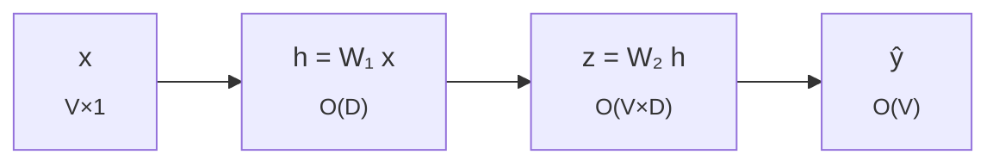

## 1. Overview

Suppose we have a list of words, of some language, and we want to assign them an embedding - a mathematical vector representation[^1]. The aim is to somehow capture the nuance of the words and its relation using vectorial operations like addition, subtraction, dot product, etc.

## 2. Approach Overview

The idea is: given a word we will try to predict its context words. For example if the words "I" and "am" appear together, we will force the model to learn this. This method is called skip-gram. Some words couple with many words, and thus we would like the embedding of that word to indicate the context of each. As the famous adage goes "You shall know a word by the company it keeps"[^4].

Let us call the list of all words as "Vocab". We order the words in Vocab in some fashion, and each word will appear at some index[^2]. Based on the index we convert the word into one-hot encoding, which is how we will talk about the word hereon. For example if length of Vocab is $$V$$ and index of word is $$i$$, then one-hot encoding is the vector [0, 0, ..., 1, ...., 0], where 1 appears at ith position and total length is $$V$$.

Now we multiply this one-hot encoding by a matrix, call it $$W_1$$ of size Embedding Dimension x $$V$$, to get the embedding. Notice that this is $$\mathcal{O}(D)$$ time operation, where $$D$$ is embedding dimension. This is because multipling by ith basis vector gives the ith column[^3].

Once we have the embedding we multiply it by another matrix, call it $$W_2$$ of size $$V \times D$$, to get the similarity vector w.r.t to each word in vocab. The matrix $$W_2$$ can be thought of a context matrix. Each row (notice there are $$V$$ rows, one for each word in order of there index in vocab) corresponds to "context" embedding of that index word. And the ith element of the resulting vector, after product of $$W_2$$ and embedding, is the dot product of context of ith index word and embedding of our word, which can be thought of as similarity score. This has $$\mathcal{O}(V \times D)$$ time complexity.

Finally just like in multi-label classification, to get $$\text{P}(\text{context} \mid \text{center})$$, we use softmax normalization. Here context is the word we are trying to predict, and center is the word that is given to us. I.e. from our earlier example, we would like the model to give P("am" $$\mid$$ "I") as very high, and rest all probabilities like P("apple" $$\mid$$ "I") as very low. Softmax step has $$\mathcal{O}(V)$$ time complexity.

Now we follow the standard pedagogy in optimization of using gradient descent. We will have to first define the loss function. Here we can use the simple cross entropy loss function, $$\mathcal{L} = \sum_{i=0}^{V-1} y_i \log \hat{y}_i$$. In our case $$y$$ is the actual one-hot encoding of the context word, so most of the $$y_i$$ are but 0. Now we will have to find $$\nabla_{W_1} \mathcal{L}$$ and $$\nabla_{W_2} \mathcal{L}$$. And once we have that we will have our iterative step as $$W_i = W_i - \alpha \times \nabla_{W_i} \mathcal{L}$$.

Before we proceed with the calculations of finding the gradient, we make it a point to tell the reader of the limitation of this approach. The vocab size can be quite large, and the number of training points, (context, center) pairs, can easily be in millions. The naive time complexity calculations would be number of epochs x number of (context, center) pairs x V x D. As the training per pair is upper capped by $$\mathcal{O}(V \times D)$$ time complexity of finding $$z$$, we use it as the time approximation per pair. Using slightly large values we get $$10^2 \times 10^7 \times 10^5 \times 2$$, we get time of order $$10^{14}$$. For a even larger dataset this approachs becomes intractable quite fast. There are certain things that can't be mitigated like number of pairs, however dependence of vocab size is not amongst those. Negative sampling is one way to avoid this overhead.

Back to gradient computation. We will find the gradient using chain rule. For example how to find gradient of $$\nabla_x f(g(x))$$ - first we find $$\nabla_z f(z)$$ where $$z = g(x)$$, and then we use the fact that $$\nabla_x f(z(x)) = \nabla_z f(z) \nabla_x z$$. Now if say instead we had to find $$\nabla_x f(g_1(x), g_2(x))$$ - we again first find $$\nabla_{z_1} f(z_1, z_2)$$ and $$\nabla_{z_2} f(z_1, z_2)$$, where $$z_i = g_i(x)$$, and then use the chain rule property that $$\nabla_x f(z_1, z_2) = \sum_{z_i} \nabla_{z_i} f(z_1, z_2) \nabla_x z_i$$. The logic is simple, if we change $$z_1$$ say function changes by 4 times, and changing $$x$$ changes $$z_1$$ by 2 times. So overall changing $$x$$ would result in function changing 8 times just by considering $$z_1$$. And similarly for $$z_2$$. And using first order approximation, the fact that change in a function across all dimensions is the linear sum of function changing only one value at a time and keeping rest constant, we get the chain rule.

We will prove these claims in order - ($$e = \hat{y} - y$$)
1. First Claim: $$\nabla_z \mathcal{L} = e$$
2. Second Claim: $$\nabla_{W_2} \mathcal{L} = e h^T$$
3. Third Claim: $$\nabla_h \mathcal{L} = W_2^T e$$
4. Fourth Claim: $$\nabla_{W_1} \mathcal{L} = W_2^T e x^T$$

*Proof of Claim 1:* Notice that $$z$$ is a vector, and $$\mathcal{L}$$ being a scalar, the gradient will be a vector. We compute partial derivative w.r.t to ith component of $$z$$.

$$
\begin{align*}
    \nabla_{z_j} \mathcal{L} &= - \sum y_i \nabla_{z_j} \log (\hat{y}_i) \\
    &= - \sum y_i \nabla_{z_j} \log (\hat{y}_i) \\
    &= - \sum \frac{y_i}{\hat{y}_i} \nabla_{z_j} \hat{y}_i \\
\end{align*}
$$

As $$\hat{y}_i = e^{z_i}  / \sum_i e^{z_i}$$, we get its partial derivative w.r.t $$z_j$$ as $$\hat{y}_i (1_{\text{i = j}} - \hat{y}_j)$$.

$$
\begin{align*}
    \nabla_{z_j} \mathcal{L} &= - \sum \frac{y_i}{\hat{y}_i} \hat{y}_i (1_{\text{i = j}} - \hat{y}_j) \\
    &= - \sum y_i (1_{\text{i = j}} - \hat{y}_j) \\
\end{align*}
$$

As we said before $$y_i$$ is 0 for all $$i$$ except for actual index, call it $$a$$. The gradient becomes $$\nabla_{z_j} \mathcal{L} = - 1 (1_{\text{a = j}} - \hat{y}_j)$$. Vectorially if you think about it, this is equal to $$\hat{y} - y$$. Which is nothing but $$e$$.

*Proof of Claim 2:*

## 3. Negative Sampling to increase speed

## 4. References

[^1]: I.e. embedding(word) $$\in R^D$$

[^2]: For example, say our Vocab is the collection of words {"I", "He", "We"}, and say we order them as "I" is at 0th index, "He" is at 1st index, and "We" is at 2nd index. Thus index of say "He" is 1.

[^3]: The mathematical way of reading a matrix as a linear transformation is that the ith column represents the transformation of ith canonical basis vector. As the vector is $$D$$ dimensional and we want to play with the values, we read it off and hence the $$\mathcal{O}(D)$$ time.

[^4]: Quoth by John Rupert Firth.

